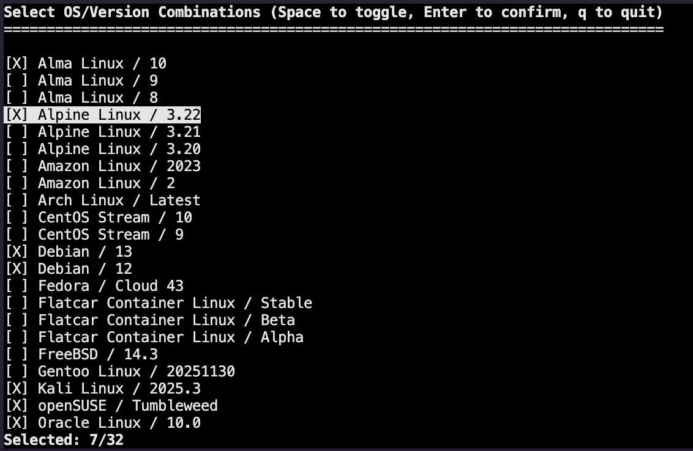

# Changelog

## 2025-12-03

- add the ability to create multiple templates at once

## 2025-12-01

- add support for the following operating systems:
  - [Gentoo Linux](https://www.gentoo.org/)
  - [Flatcar Container Linux](https://www.flatcar.org/)
  - [FreeBSD](https://www.freebsd.org/)

## 2025-11-30

- add support for custom [cloud-init](https://cloudinit.readthedocs.io/en/latest/) files