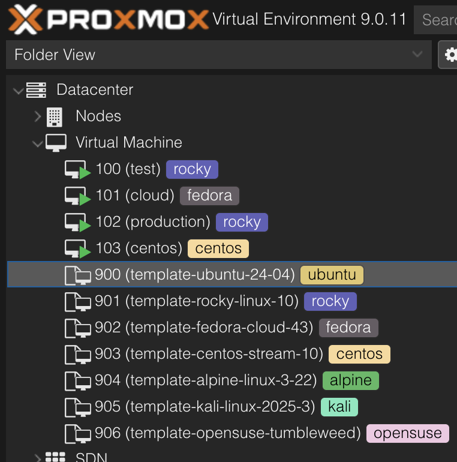

# Proxmox Templates

[](https://opensource.org/licenses/MIT)

A Python tool for automating the creation of cloud-init enabled VM templates in Proxmox VE. Simplifies downloading official cloud images and converting them into ready-to-use templates.



## Features

- Automated template creation from cloud images
- Automatic VM ID assignment (starting at 900)
- Smart storage selection from available pools
- Cloud-init support with SSH key integration
- Support for 10+ Linux distributions
- Interactive command-line interface
- QEMU guest agent pre-configured
- Automatic cleanup of temporary files

## Prerequisites

- Proxmox VE 7.0 or higher
- Python 3
- Root or sudo access
- Sufficient storage space
- Internet connection
- SSH public key (recommended)

## Quick Start

SSH into your Proxmox node and run:

```bash
python3 <(curl -s https://raw.githubusercontent.com/rothdennis/Proxmox-Templates/main/generate.py)
```

Or download first:

```bash
wget https://raw.githubusercontent.com/rothdennis/Proxmox-Templates/main/generate.py
python3 generate.py
```

Follow the interactive prompts to:
1. Enter username (default: root)
2. Set password
3. Paste SSH public key
4. Select storage pool
5. Choose OS and version

The script automatically assigns the next available VM ID starting at 900.

## Supported Operating Systems

| OS | Versions |Images|
|:---|:--|:--|
| [**Alpine**](https://alpinelinux.org/) | 3.22, 3.21, 3.20 | [Link](https://alpinelinux.org/cloud/) |
| [**Alma Linux**](https://almalinux.org/) | 10, 9, 8 | [Link](https://almalinux.org/get-almalinux/#Cloud_Images) |
| [**Amazon Linux**](https://aws.amazon.com/de/linux/) | 2023<br>2 | [Link](https://cdn.amazonlinux.com/al2023/os-images/latest/)<br>[Link](https://cdn.amazonlinux.com/os-images/latest/)  |
| [**Arch Linux**](https://archlinux.org/) | Latest | [Link](https://mirror.pkgbuild.com/images/latest/) |
| [**CentOS Stream**](https://www.centos.org/) | 10, 9 | [Link](https://cloud.centos.org/centos/) |
| [**Debian**](https://www.debian.org/) | 13 (Trixie), 12 (Bookworm) | [Link](https://cloud.debian.org/images/cloud/) |
| [**Fedora**](https://getfedora.org/) | Cloud 43 | [Link](https://fedoraproject.org/cloud/download) |
| [**Kali Linux**](https://www.kali.org/) | 2025.3 | [Link](https://www.kali.org/get-kali/#kali-cloud) |
| [**openSUSE**](https://www.opensuse.org/) | Tumbleweed | [Link](https://get.opensuse.org/tumbleweed/?type=server#download) |
| [**Oracle Linux**](https://www.oracle.com/linux/) | 10.0, 9.6, 8.10, 7.9 | [Link](https://yum.oracle.com/oracle-linux-templates.html) |
| [**Rocky Linux**](https://rockylinux.org/) | 10, 9, 8 | [Link](https://rockylinux.org/download) |
| [**Ubuntu**](https://ubuntu.com/) | 25.10, 25.04, 24.04 LTS, 22.04 LTS | [Link](https://cloud-images.ubuntu.com/) |

## Template Specifications

| Component | Default Configuration |
|-----------|----------------------|
| Memory | 1 GB |
| CPU | 2 cores, 1 socket, host type |
| Network | VirtIO on vmbr0 |
| Disk | 10 GB, VirtIO SCSI |
| Cloud-Init | Enabled with SSH keys |
| Guest Agent | Enabled |

## Using Templates

**Via Web UI:**
- Right-click template → Clone → Full Clone
- Set VM ID and name
- Customize settings as needed

**Via CLI:**
```bash
qm clone <template-id> <new-vm-id> --name <vm-name> --full
```

**Resize disk after cloning:**
```bash
qm resize <vm-id> scsi0 +10G
```

## Customizing Defaults

Edit these constants at the top of `generate.py`:

```python
MEMORY = 2048              # Change memory (default: 1024)
CORES = 4                  # Change CPU cores (default: 2)
DISK_SIZE = '20G'          # Change disk size (default: '10G')
NETWORK_BRIDGE = 'vmbr1'   # Change network bridge (default: 'vmbr0')
PREFIX = 'my-template'     # Change template name prefix (default: 'template')
ID_START = 1000            # Change starting VM ID (default: 900)
```

## Troubleshooting

**Storage not found:**
- Check available storage: `pvesm status`
- Ensure storage is enabled and mounted

**Download fails:**
- Check internet connectivity
- Verify Proxmox can reach external URLs
- Try again

**Insufficient disk space:**
- Free up space or choose different storage
- Cloud images typically need 2-5GB during download

**Template not visible:**
- Refresh Proxmox web interface
- Check correct node in tree view

**Check logs:**
```bash
tail -f /var/log/pve/tasks/active
```

## Contributing

Contributions welcome! Please:
- Report issues on GitHub
- Submit pull requests with clear descriptions
- Test changes on Proxmox
- Update documentation

## Credits

- Based on [this project](https://www.apalrd.net/posts/2023/pve_cloud/) by apalrd
- Cloud images provided by respective Linux distributions

---

**Note:** Unofficial tool, not affiliated with Proxmox Server Solutions GmbH or any Linux distributions.

Made with ❤️ for the Proxmox community