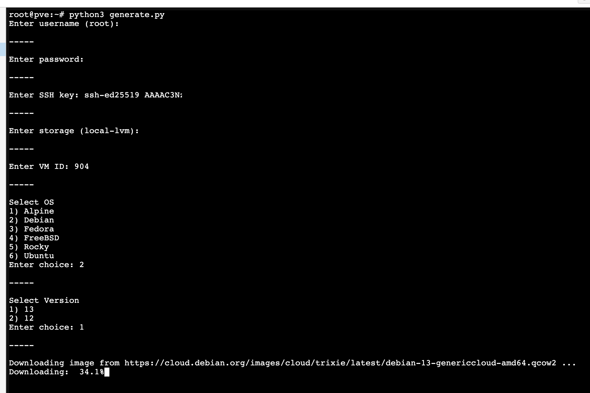

# Proxmox Templates

Based on [this project](https://www.apalrd.net/posts/2023/pve_cloud/)

## Usage 

Run the following commands on the `Console` for the specific Node:

```bash
curl -LO https://raw.githubusercontent.com/rothdennis/Proxmox-Templates/main/generate.py
python3 generate.py
```



## Supported Images

|OS|Version|
|:---|---:|
|Alpine|3.22<br>3.21<br>3.20|
|Alma Linux|10<br>9<br>8|
|CentOS Stream|10<br>9|
|Debian|13<br>12|
|Fedora|43|
|FreeBSD|14.3|
|openSUSE|Tumbleweed|
|Rocky|10<br>9<br>8|
|Ubuntu|25.10<br>25.04<br>24.04<br>22.04|